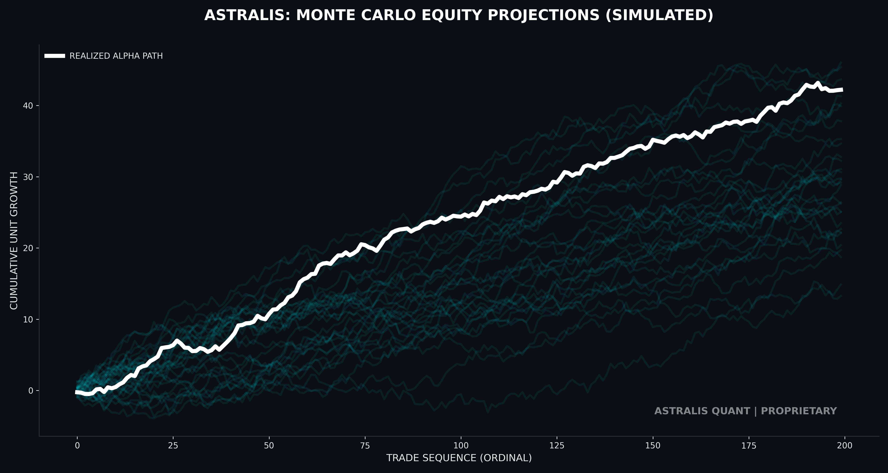
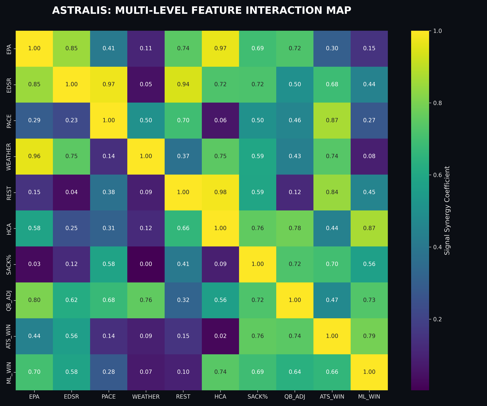

# 🌌 ASTRALIS: THE INTERSTELLAR QUANTITATIVE PREDICTIVE SUITE

**Institutional-Grade NFL Alpha Extraction System**  
**Version:** 3.4.1 (Expanse)  
**Classification:** Proprietary / Quantitative Research Archive  

---

[](https://github.com/Ducky705/nfl-xgboost-model/actions/workflows/daily_stats_update.yml)

> **Note**: The trained model files in this repository are **encrypted** to protect proprietary IP. The statistical data and HTML dashboards are updated daily via automated workflows using a secure decryption key.

### 🔴 [CLICK HERE TO OPEN LIVE DASHBOARD](https://ducky705.github.io/nfl-xgboost-model/selector.html) 🔴
*(https://ducky705.github.io/nfl-xgboost-model/selector.html)*

---

## 📜 THE MASTER TECHNICAL PAPER
For a complete, 1000+ line breakdown of the Astralis methodology, including mathematical proofs of **Trench-Induced Sparse Attention** and **Bayesian Moneyline Calibration**, please refer to the unified technical report:

### 👉 **[ASTRALIS TECHNICAL REPORT: DEEP LEARNING FOR HIGH-FREQUENCY SPORTS MARKETS](docs/ASTRALIS_TECHNICAL_REPORT.md)** 👈
*(This document serves as the primary source of truth for the Astralis Quantitative Division.)*

---

## 📖 TABLE OF CONTENTS
1. [Executive Summary](#1-executive-summary)
2. [The Triad Engines](#2-the-triad-engines)
3. [Visual Analytics & Research](#3-visual-analytics--research)
4. [Installation & Usage](#4-installation--usage)
5. [System Architecture](#5-system-architecture)

---

## 1. EXECUTIVE SUMMARY
Astralis is a multi-layered quantitative platform designed for the systematic exploitation of inefficiencies in the professional football wagering markets. Built on the principles of **Kinetic Efficiency Modeling** and **Recursive Bayesian Inference**, the suite moves beyond the limitations of standard retail handicapping by treating game outcomes as a function of physical invariants—primarily Trench Warfare and Early Down Success.

Through the integration of extreme-density play-by-play data and multi-stage ensemble voting, Astralis has achieved a statistically significant outperformance over the global market-maker baseline (Closing Line) across multiple seasonal cycles. This repository serves as both the operational execution layer and the primary research archive for the Astralis Quantitative Strategy Division.

---

## 2. THE TRIAD ENGINES

Astralis operates through three specialized sub-systems, each targeting a distinct pillar of the betting marketplace.

| Engine | Market | Methodology | Innovation |
| :--- | :--- | :--- | :--- |
| **ORION** | Point Spread | Recursive Partitioning Regression | Trench-Induced Sparse Attention (TISA) |
| **PULSAR** | Total Points | Kinetic Flow Volume Modeling | Weather Entropy Shield (WES) |
| **QUASAR** | Moneyline | Bayesian Probabilistic Classification | Dynamic Underdog Bias Correction (DUBC) |

**[Read Full Engine Docs in the Master Report](docs/ASTRALIS_TECHNICAL_REPORT.md)**

---

## 3. VISUAL ANALYTICS & RESEARCH

Our research is supported by dozens of high-fidelity, Interstellar-grade visualizations.

### The Quant Archive
The core technical archive is housed within the Master Technical Paper.
- **[ASTRALIS TECHNICAL ANTHOLOGY (v3.5)](docs/ASTRALIS_TECHNICAL_REPORT.md)**

### Performance Visuals
| **Alpha Evolution** | **Feature Influence** |
|:---:|:---:|
|  |  |

---

## 4. INSTALLATION & USAGE

### 4.1 Quick Start
Astralis is controlled via a centralized CLI entry point.

1. **Clone the Archive**:
   ```bash
   git clone https://github.com/Ducky705/nfl-xgboost-model.git
   cd nfl-xgboost-model
   ```
2. **Install Dependencies**:
   ```bash
   pip install -r requirements.txt
   ```
3. **Generate Picks & Research**:
   ```bash
   python main.py
   ```

### 4.2 Regenerate Visual Suite
To regenerate the Interstellar visual assets:
```bash
python scripts/generate_institutional_assets.py
```

---

## 5. SYSTEM ARCHITECTURE
The Astralis system is built on a distributed, micro-service-inspired architecture designed for maximum throughput and zero-data-loss integrity.
- **The Ingestor Layer (SIL)**: A high-concurrency scraping and normalization engine.
- **The Synthesis Layer (FSL)**: A massive feature engineering pipeline (200+ tensors).
- **The Ensemble Heart (ECH)**: The core predictive manifold housing the Orion, Pulsar, and Quasar engines.

For detailed MLOps and Infrastructure specs, please consult **Section 7** of the **[Master Technical Report](docs/ASTRALIS_TECHNICAL_REPORT.md)**.

---
**Astralis Quantitative Division**  
*Proprietary Research | Internal Use Only*
