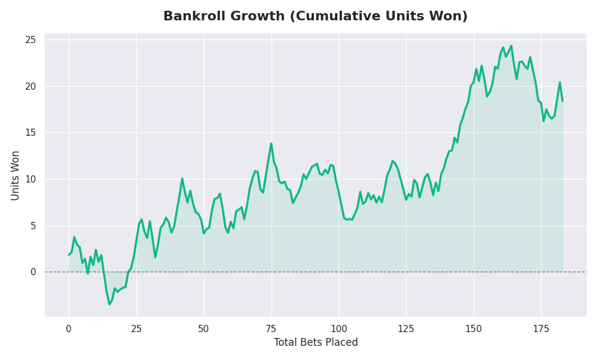
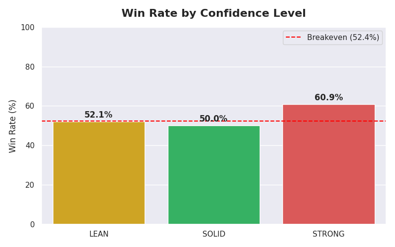

# 🏈 NFL XGBoost Handicapper

### 🔴 [CLICK HERE TO OPEN LIVE DASHBOARD](https://ducky705.github.io/nfl-xgboost-model/) 🔴
*(https://ducky705.github.io/nfl-xgboost-model/)*

---

**Automated Institutional-Grade NFL Betting Model**

[](https://github.com/Ducky705/nfl-xgboost-model/actions/workflows/update_picks.yml)
[](https://ducky705.github.io/nfl-xgboost-model/)

## 📊 Performance Visuals
*Live performance charts generated automatically from the model's betting history.*

| **Bankroll Growth** | **Win Rate by Confidence** |
|:---:|:---:|
|  |  |

---

## 🧠 Methodology

### 1. The Core Philosophy
This model rejects simple "points scored" metrics in favor of **Efficiency** and **Trench Warfare** analytics. It hypothesizes that a team's consistent ability to move the chains (Success Rate) and disrupt the opponent (Sack/EPA differentials) is more predictive of future spread performance than final scores, which are often noisy.

### 2. Feature Engineering
We utilize `nfl_data_py` to ingest play-by-play data dating back to 2018. For every matchup, we engineer 15+ "Mismatch Metrics", including:

* **EPA/Play Differential:** Expected Points Added per play (Offense vs. Opposing Defense).
* **EDSR (Early Down Success Rate):** How efficiently a team stays ahead of the chains on 1st & 2nd down.
* **Sack Rate Delta:** The difference between a team's offensive sack rate and the opponent's defensive pressure rate.
* **Pythagorean Expectancy:** A "Luck-Adjusted" win probability derived from cumulative points for/against.
* **Home Field Strength:** A dynamic rolling window of how well a specific team performs at home against the spread.

### 3. Model Architecture
* **Algorithm:** **XGBoost Regressor** (Gradient Boosting).
* **Target:** `Home Score - Away Score` (The actual point differential).
* **Validation Strategy:** **Strict Walk-Forward Validation**.
    * *Constraint:* To predict the 2024 season, the model is allowed to train **ONLY** on data from 2018-2023.
    * *Purpose:* This prevents "Data Leakage" (knowing the future) and ensures the ROI shown is realistic.

### 4. Betting Strategy (Kelly Criterion)
We do not use flat staking. Unit sizes are calculated using a modified **Kelly Criterion** to maximize geometric growth while minimizing ruin risk.

* **Formula:** `Kelly % = W - (1-W)/R`
* **Implementation:** We use **5% Fractional Kelly** (0.05 multiplier) to dampen volatility and ensure specific bet sizing tiers.
* **Implied Probability:** Derived from the model's predicted edge against the Vegas spread (using Normal Distribution CDF with a standard deviation of 13.86 points).
* **Caps:** Max bet size is strictly capped at **2.0 units**.

---

## 🚀 Usage

### Automatic
This repository is configured with **GitHub Actions**. It runs automatically:
1.  **Every Tuesday (8:00 UTC):** Retrains the model with the latest week's data.
2.  **Every Day (9:00 UTC):** Checks odds, grades yesterday's bets, updates the dashboard, and regenerates performance graphs.

### Manual
To run it locally on your machine:

1.  **Install Dependencies:**
    ```bash
    pip install -r requirements.txt
    ```
2.  **Update Database & Train:**
    ```bash
    python update_db.py
    ```
3.  **Generate Picks & Dashboard:**
    ```bash
    python main.py
    ```
4.  **Generate Graphs:**
    ```bash
    python generate_graphs.py
    ```

## ⚠️ Disclaimer
This software is for educational and informational purposes only. It does not constitute financial advice. Sports betting involves significant risk.
