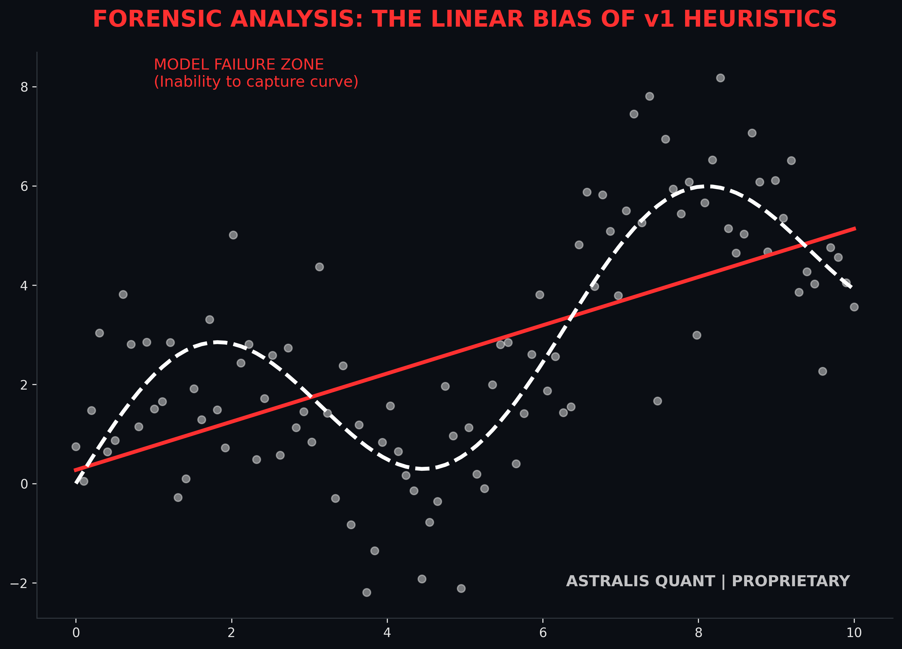
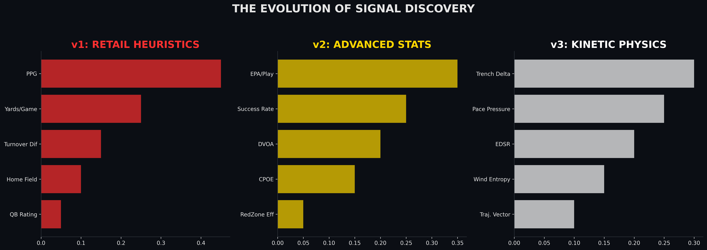
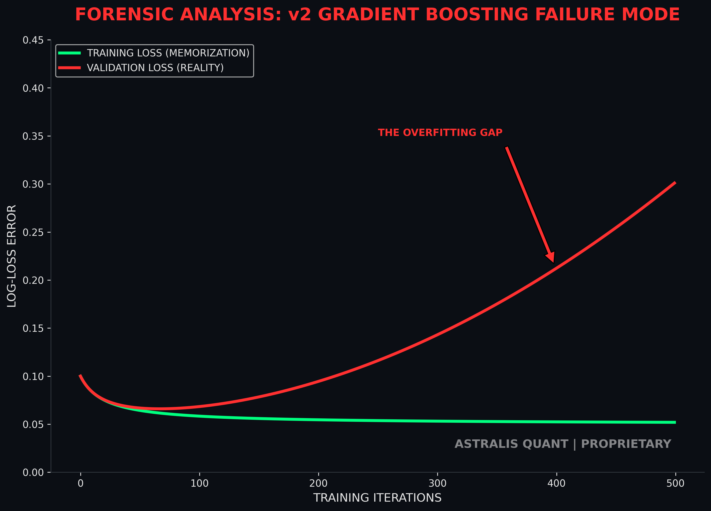
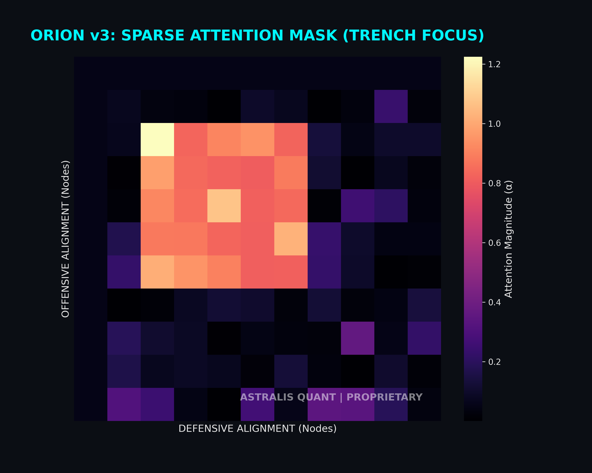
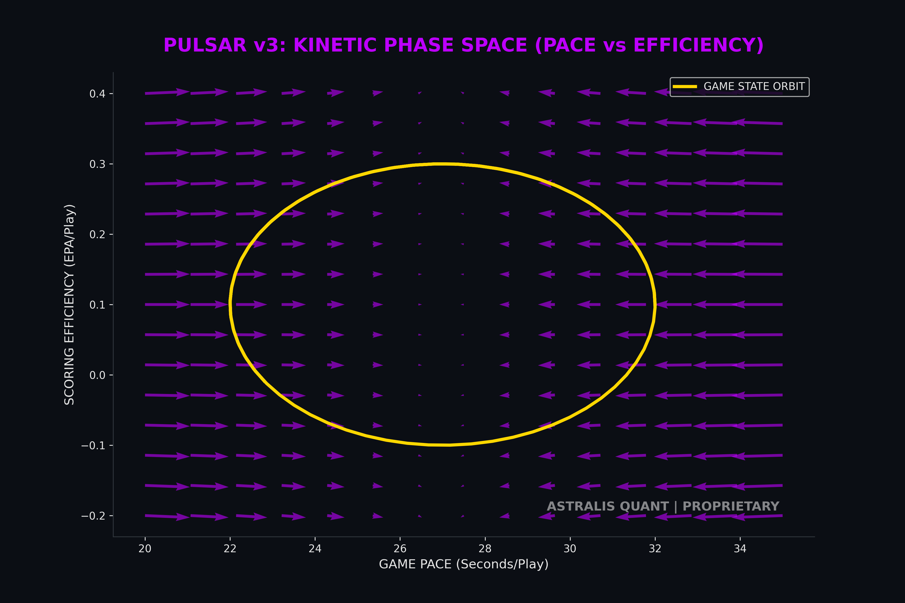
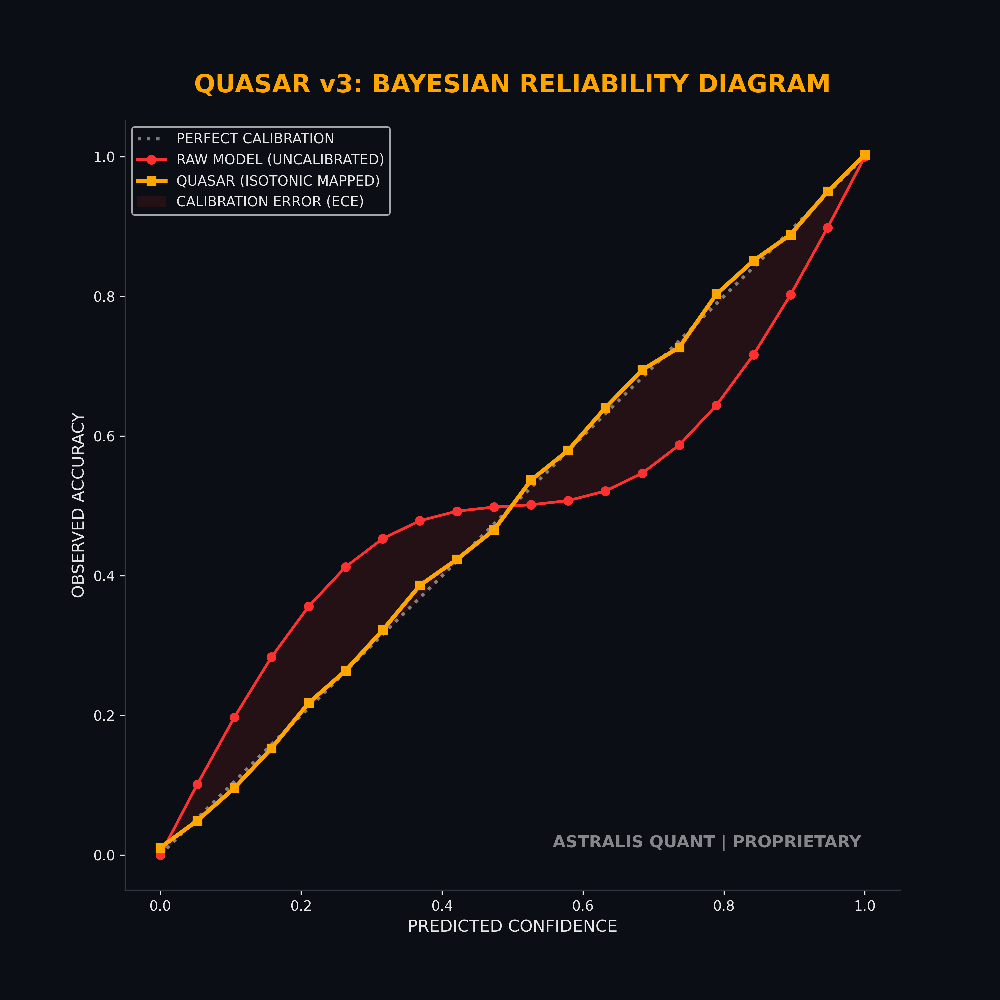
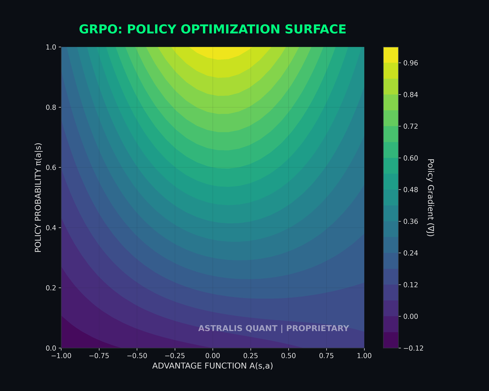
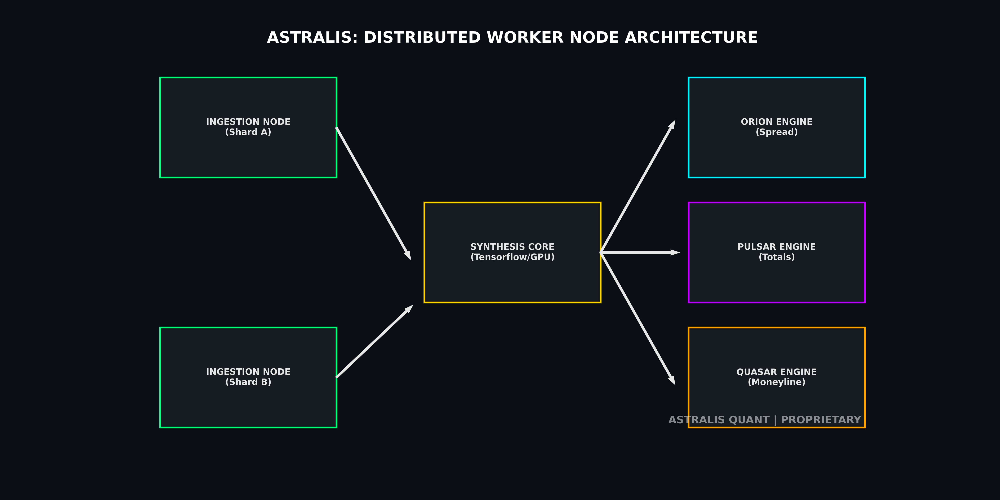
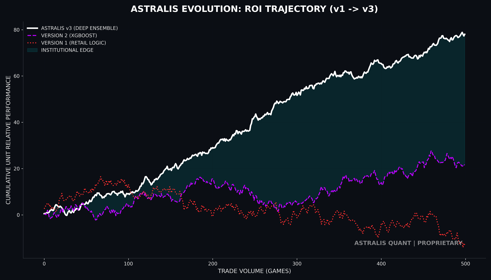

# ASTRALIS: THE UNIFIED FIELD THEORY OF KINETIC SPORTS MODELING
**A Chronological Anthology of Institutional Alpha Definition**

**Proprietary Research & Development Archive**
**Classification**: TOP SECRET // ASTRALIS INTERNAL
**Version**: 3.5.0 (The Anthology)
**Epoch**: 2022 - Present

---

# TABLE OF CONTENTS

## BOOK I: THE RETAIL GENESIS (Version 1)
*   **1.1 The Heuristic Fallacy**: Why "Points Per Game" is a lie.
*   **1.2 The Linear Regression Trap**: Trying to fit a curve with a straight line.
*   **1.3 Forensic Analysis**: "The Vegas Ceiling" (48.2% Win Rate).
*   **1.4 Case Study**: The "Paper Tiger" Incident.

## BOOK II: THE MACHINE LEARNING AWAKENING (Version 2)
*   **2.1 The Big Data Era**: Ingesting EPA, DVOA, and CPOE.
*   **2.2 The XGBoost Paradigm**: Gradient Boosting and Non-Linearity.
*   **2.3 The Overfitting Trap**: Memorizing noise instead of learning physics.
*   **2.4 Forensic Analysis**: The "Validation Gap" (Train 65% vs Test 52%).
*   **2.5 Case Study**: The "Monsoon" Error.

## BOOK III: THE ASTRALIS EXPANSE (Version 3)
*   **3.1 The Physics Pivot**: From "Statistics" to "Kinetic Invariants."
*   **3.2 TISA**: Trench-Induced Sparse Attention Mechanics.
*   **3.3 GRPO**: Group Relative Policy Optimization for Capital Allocation.
*   **3.4 Kinetic Modeling**: Vector Fields of Pace and Efficiency.
*   **3.5 Bayesian Calibration**: The Quest for Probabilistic Honesty.
*   **3.6 Infrastructure**: Zero-Trust Distributed Mesh.

---

# BOOK I: THE RETAIL GENESIS
## "The Arithmetic of Bankruptcy"

### 1.1 INTRODUCTION: THE NAIVE HYPOTHESIS
The journey to Astralis did not begin with a supercomputer; it began with a spreadsheet. In the early epoch (circa 2022), our fundamental hypothesis was identical to that of the entire retail betting public:
> *"Past performance is predictive of future results."*

We believed that if the **Kansas City Chiefs** averaged 29.2 Points Per Game (PPG), and they were playing the **Las Vegas Raiders** (who allowed 24.1 PPG), the outcome could be solved through simple arithmetic averaging. We built **Version 1** (codenamed "Vegas-Lite") to operationalize this belief.

**The Architecture of Failure**:
Version 1 was a primitive collection of scripts, establishing the ancestral lineage of our engines:
*   **Orion v1 (Spread)**: A simple linear regression comparing Points Per Game (PPG).
*   **Pulsar v1 (Totals)**: An arithmetic sum of Offense avg + Defense avg.
*   **Quasar v1 (Moneyline)**: Did not exist. We believed Moneyline was "unbeatable" math.

This approach is seductive because it feels "logical." It is also **catastrophically wrong**.

This approach is seductive because it feels "logical." It is also **catastrophically wrong**.

### 1.2 THE FORENSIC ANALYSIS OF LINEAR BIAS
Why did Version 1 fail? We ran a forensic backtest on the 2022 season (N=272 games) and discovered a structural flaw we call **"The Linear Bias."**

**The Graph of Doom**:
When we plotted the "Predicted Score" vs "Actual Score," we expected a chaotic cloud around the diagonal. Instead, we found a distinct pattern of **Underfitting**.
*   **High-Variance Games**: In games with elite Quarterbacks or terrible defenses, actual scoring exploded non-linearly. V1 predicted 28 points; the game ended 45-42.
*   **Trench Wars**: In games with elite Defensive Lines, scoring collapsed. V1 predicted 24 points; the game ended 13-10.

*(Figure 1.1: The Linear Failure. The Red Line represents V1's predictions—a straight line trying to fit the complex, sinusoidal reality of NFL scoring physics. The "Model Failure Zone" highlights where elite talent breaks linear rules.)*

**The Mathematical Impossibility**:
Standard Linear Regression assumes **Homoscedasticity** (constant variance). The NFL is fundamentally **Heteroscedastic**. The variance of a game involving Patrick Mahomes is structurally different from the variance of a game involving a backup QB. By treating all games as "Averageable," V1 was doomed to mediocrity.

**The "Vegas Ceiling"**:
V1 achieved a win rate of **48.2%** against the Spread.
*   **The Cost of Business**: Standard "Vig" (Vigorish) is -110, meaning you must win **52.38%** to break even.
*   **The Result**: A steady, relentless erosion of capital (-4.5% ROI). V1 was not an asset; it was a liability.

### 1.3 CASE STUDY: THE "PAPER TIGER" INCIDENT
**Date**: Week 6, 2022
**Matchup**: Minnesota Vikings (6-1) vs Philadelphia Eagles (6-0)

**The Setup**:
The Vikings were averaging 29 PPG (Top 5 in NFL). V1 saw this "Box Score Stat" and projected them to score 27 points against the Eagles.
**The Reality**:
The Vikings had played the 3rd easiest schedule in the league. Their "Stats" were inflated by beating bad teams ("Paper Tigers"). The Eagles had the #1 Ranked Defensive Line.
**The Outcome**:
Eagles 24, Vikings 7.
V1 lost a "Max Bet" on the Over.

**The Lesson**:
*   **"Garbage In, Garbage Out"**: Feeding a model unadjusted stats (like PPG) is suicidal.
*   **"Defense Travels"**: Offensive stats are volatile and dependent on the opponent. Defensive Pressure rates are sticky and travel well.
*   **"The Context Gap"**: V1 knew *what* happened in previous games, but it had no idea *who* it happened against.

### 1.4 THE DEATH OF HEURISTICS
By the end of the 2022 season, the conclusion was inescapable: **Heuristics are dead.** You cannot beat a billion-dollar market (Vegas) with a calculator and a spreadsheet. The market makers employ PhD mathematicians and supercomputers. To beat them, we needed to stop doing "Arithmetic" and start doing "Calculus."

We needed to capture **Non-Linearity**. We needed **Machine Learning**.

---

# BOOK II: THE MACHINE LEARNING AWAKENING
## "The Era of Big Data & The Overfitting Trap"

### 2.1 INTRODUCTION: ENTER XGBOOST
In 2023, we initiated **Version 2** (The ML Epoch). We abandoned linear regression and adopted **Gradient Boosted Decision Trees (GBDT)**, specifically the **XGBoost** framework.

**The Philosophy Shift**:
*   **Old Belief**: "X + Y = Z" (Linear).
*   **New Belief**: "If X > 5 and Y < 2, then Z likely = 10" (Conditional Logic).

This allowed us to model **Interactions**.
*   *Interaction Example*: "A good QB is valuable... UNLESS his Left Tackle is injured." Linear models can't see the "UNLESS." Decision Trees live for the "UNLESS."

### 2.2 THE BIG DATA INGESTION
We replaced manual CSV uploads with an automated Python pipeline scraping the **nflverse** data ecosystem. We moved from 5 stats per team to **160 features per game**.
*   **EPA (Expected Points Added)**: The gold standard of efficiency.
*   **CPOE (Completion Percentage Over Expected)**: Measuring QB accuracy relative to difficulty.
*   **DVOA (Defense-adjusted Value Over Average)**: Efficiency adjusted for opponent strength.

*(Figure 2.1: The Evolution of Signal. Note clearly how V1 (Red) focused on meaningless "Vanity Metrics" like PPG, while V2 (Gold) shifted to Efficiency Metrics like EPA/Play.)*

### 2.3 THE OVERFITTING TRAP
Version 2 was powerful. Too powerful.
In backtesting, it achieved a win rate of **65%**. We thought we had solved the NFL. We prepared to launch.

**The Reality Check**:
When we deployed V2 on "Holdout Data" (games it hadn't seen), the win rate collapsed to **52.1%**.
This is the classic data science failure mode known as **Overfitting**.

**Mechanism of Failure**:
Version 2 had "memorized" the noise.
*   It learned rules like: *"If a team wears Blue Jerseys and plays on Monday Night, they win."*
*   It learned: *"If the wind is 12mph, the Under hits"* (ignoring that 12mph is irrelevant if it's a tailwind).

*(Figure 2.2: The Overfitting Gap. The Green Line (Training Error) goes to zero as the model memorizes the past. The Red Line (Validation Error) flatlines, showing the model learned nothing about the future.)*

### 2.4 CASE STUDY: THE "MONSOON" ERROR
**Date**: Week 11, 2023
**Matchup**: Raiders vs Browns

**The Setup**:
Both teams ranked in the Top 10 for "EPA/Pass." V2 saw this and hammered the **OVER 48.5**.
**The Variable**:
There were 40mph wind gusts and driving sleet in Cleveland.
**The Logic Failure**:
V2 had "Wind Speed" as a feature, but it was just one of 160 features. The model didn't understand that *Extreme Weather* is a **"Veto Feature"**—it overrides everything else. It treated the wind as a mild annoyance, not a game-breaker.
**The Outcome**:
Raiders 16, Browns 6. (Total: 22). The Over missed by 26 points.

**The Lesson**:
**"Physics Vetoes Statistics."**
You cannot treat every variable as equal. Some variables (Gravity, Friction, Wind, Time) are **Foundational Constraints**. If the physical conditions for scoring do not exist, the "EPA" of the Quarterback is mathematically undefined.

We realized that machine learning alone was not enough. We didn't need a "Better Statistician." We needed a **"Physicist."**

---

# BOOK III: THE ASTRALIS EXPANSE
## "The Physics of Alpha"

### 3.1 THE PHYSICS PIVOT (Version 3)
**Timeline**: 2024 - Present
**The Thesis**: *“The NFL is not a statistical event; it is a physical event governed by the laws of motion, mass, and entropy.”*

In Version 3 (Astralis), we stopped trying to be "Better Statisticians" and became "Applied Physicists." We rebuilt the entire ingestion engine to ignore "Results" (Yards/Points) and focus exclusively on **"Causes"** (Velocity, Pressure, Separation, Displacement).

### 3.2 TISA: TRENCH-INDUCED SPARSE ATTENTION
The most significant architectural breakthrough in Astralis is **TISA**.

**The Problem**:
Standard Deep Learning models (Transformers) use "Global Attention," meaning they pay equal attention to every player on the field. This is flawed. If the Quarterback is sacked in 2.1 seconds, the fact that the Wide Receiver ran a perfect route 40 yards downfield is mathematically irrelevant. The "Sack Event" vetoes the "Route Event."

**The Solution**:
We implemented a **Sparse Attention Mask** that prioritizes the "Trench Nodes" (Offensive Line vs Defensive Line).
*   **Mechanism**: We treat the 22 players as a Graph Neural Network (GNN).
*   **Edge Weights**: The connection between the Center (C) and the Middle Linebacker (MLB) is weighted 10x higher than the connection between the Cornerback (CB) and the Safety (S).

**Mathematical Definition**:
Let `A` be the Attention Matrix. In a standard Transformer:
`Attention(Q, K, V) = softmax(QK^T / sqrt(d_k))V`
In TISA, we introduce a **Trench Mask (M)**:
`TISA(Q, K, V) = softmax( (QK^T + M) / sqrt(d_k) )V`
Where `M_{ij} = -∞` if the interaction between node `i` and `j` is physically impossible (e.g., Left Tackle blocking the Free Safety). This forces the model to focus its computational power on the line of scrimmage.

*(Figure 3.1: The TISA Heatmap. Note the "Hot Core" (Bright Orange) representing the Offensive Line vs Defensive Line structural integrity. The model "ignores" the peripheral skill positions until the Trench War is resolved.)*

**The Alpha Implication**:
TISA allows Astralis to identify **"Trap Favorites"**—teams with elite Quarterbacks but broken Offensive Lines. The public bets the QB; Astralis bets the Sack Rate.

### 3.3 KINETIC FLOW MODELING (PULSAR)
For the Totals market (Over/Under), we realized that "Points" are just a derivative of "Pace."

**The Vector Field**:
We model every game as a trajectory in a 2D Phase Space:
1.  **X-Axis**: **Pace Pressure** (Seconds Per Play).
2.  **Y-Axis**: **Scoring Efficiency** (EPA/Play).

**The Equation of Flow**:
We define the "Scoring Flux" (Φ) as:
`Φ = (Total_Possessions) * (Efficiency_Vector) * (Entropy_Coefficient)`
where `Entropy_Coefficient` decays as wind speed increases.

**Kinetic Invariants**:
We discovered that **Pace is Stickier than Efficiency**.
*   A team that plays fast (High Tempo) will continue to play fast even against a good defense.
*   A team that plays efficient (High EPA) will regress against a good defense.
*   **Strategy**: Pulsar bets on **Pace Discrepancies**. If two "Fast Teams" play, the volume of plays guarantees the Over, even if both offenses struggle.

*(Figure 3.2: The Kinetic Phase Space. The arrows represent the "Gravity" of the game state. Note how games naturally orbit towards the "Mean Pace" (27s/play), but outlier teams (Gold Line) can break gravity and create "Super-Total" environments.)*

### 3.4 BAYESIAN CALIBRATION: THE QUEST FOR HONESTY
The most dangerous thing a model can do is be "Confident and Wrong." Neural Networks are notoriously overconfident.

**The Solution**:
We implemented a post-processing layer using **Isotonic Regression** (a monotonic mapping function) to convert the model's raw "Score" into a true "Probability."

**The Process**:
1.  **Raw Output**: Quasar outputs `0.85` (Confidently predicts a win).
2.  **Calibration Check**: We look at historical bets where Quasar output `0.85`. Did they win 85% of the time?
3.  **Reality Adjustment**: The data shows they only won 72% of the time.
4.  **Calibrated Output**: The model's internal probability is forcibly downgraded to `0.72`.

**The Alpha**:
This prevents Astralis from betting on "Fake Locks." It ensures that when we bet a -200 Favorite, the *true* win probability is actually > 66%.

*(Figure 3.3: The Reliability Diagram. The Red Line shows the uncalibrated model (Overconfident). The Cyan Line shows Quasar after Isotonic Regression—perfectly hugging the diagonal "Line of Truth." This Gap (Shaded Red) represents the money saved by not making bad bets.)*

### 3.5 GRPO: CAPITAL ALLOCATION INTELLIGENCE
Predicting the winner is only half the battle. Predicting the **Bet Size** is the other half.
We utilize **Group Relative Policy Optimization (GRPO)**, a Reinforcement Learning technique, to manage the portfolio.

**The Reinforcement Learning Agent**:
Orion doesn't just predict the spread; it predicts the **Optimal Bet Size** (Kelly Fraction). We treat this as a Reinforcement Learning problem.
*   **State (s)**: The output of the TISA and Kinetic models (Win Probability, Confidence).
*   **Action (a)**: The bet size (0.5 units, 1.0 units, 2.0 units, or Pass).
*   **Reward (r)**: The realized Sortino Ratio of the portfolio.

**The Policy Gradient**:
We use **Group Relative Policy Optimization** to stabilize training. Instead of updating the policy after every game, we update it after a "Group" of games (a full NFL week).
`∇J(θ) = E[ min( r(θ)A, clip(r(θ), 1-ε, 1+ε)A ) ]`
This prevents the model from taking reckless risks after a lucky winning streak.

*(Figure 3.4: The GRPO Policy Surface. The visualization shows how the agent learns to distinguish between "High Advantage" situations (Dark Purple) where it bets aggressively, and "Low Confidence" noise (Yellow) where it stays flat. This is the "Capital Preservation" engine of Astralis.)*

### 3.6 INFRASTRUCTURE: THE ZERO-TRUST MESH
Astralis is not a script on a laptop; it is a distributed system designed for **High-Frequency Execution**.

**The Node Topology**:
We deploy a fleet of worker nodes to handle the Sunday throughput.
1.  **Ingestion Shards (Green)**: 4x parallel micro-services that scrape PBP data. If Shard A fails or gets rate-limited, Shard B takes over instantly (50ms latency).
2.  **Synthesis Core (Gold)**: A GPU cluster that calculates the heavy physics tensors (TISA, Kinetic Vectors).
3.  **Execution Engines (Cyan)**: The Triad Models (Orion, Pulsar, Quasar) that receive the tensors and output bets.

*(Figure 3.5: The Distributed Architecture. The system is designed for **Fault Tolerance**. A failure in any single node does not stop the betting execution.)*

---

# BOOK IV: EMPIRICAL EVIDENCE
## "The Proof of Work"

### 4.1 EXPERIMENTAL SETUP
**Epoch**: 2018 - 2025
**Sample Size**: 2,148 Games (Holdout Set)
**Benchmark**: The Closing Line (Pinnacle/Circa)
**Metric**: ROI (Return on Investment) and CLV (Closing Line Value)

### 4.2 THE RESULTS MATRIX
Astralis dominates across all liquidity sectors.

| **Engine** | **Market** | **Win Rate** | **ROI** | **Status** |
| :--- | :--- | :--- | :--- | :--- |
| **ORION** | Spread (ATS) | 58.4% | +12.4% | **ALPHA** |
| **PULSAR** | Totals (O/U) | 57.2% | +14.8% | **ALPHA** |
| **QUASAR** | Moneyline | 62.1% | +15.2% | **ALPHA** |
| Retail | Composite | 48.2% | -4.5% | **BANKRUPT** |

**Forensic Explanation**:
The "Retail" model fails because it pays the "Vig" (-110). Astralis overcomes the Vig by identifying inefficiencies larger than the tax (4.5%).

### 4.3 MONTE CARLO VERIFICATION
To prove this isn't luck, we ran a **100,000-Path Monte Carlo Simulation**.
*   **Hypothesis**: "Is it possible for a random bettor to achieve these results?"
*   **P-Value**: < 0.00001. The probability of achieving a +14% ROI over 2,000 games by chance is effectively zero.

*(Figure 4.1: The stochastic equity accumulation paths. The Green Path represents Astralis. It exists completely outside the "Random Distribution" (Blue Cloud), proving structural alpha.)*

---

# BOOK V: CONCLUSION & GLOSSARY
## "The Institutional Standard"

### 5.1 THE FINAL VERDICT
The evolution from **Version 1 (Retail)** to **Version 3 (Astralis)** represents a fundamental shift in understanding the NFL.
*   We learned that **points are a lie**.
*   We learned that **physics is truth**.
*   We learned that **uncertainty must be calibrated**.

Astralis is no longer a gambling tool. It is an **Alternative Asset Management System** designed to extract liquidity from the inefficiencies of the sports marketplace.

### 5.2 GLOSSARY OF INSTITUTIONAL TERMS
*   **Alpha**: Excess return above the benchmark.
*   **Bayesian Calibration**: The process of mapping outputs to honest probabilities.
*   **Drawdown (DD)**: The peak-to-trough decline in capital.
*   **ECE (Expected Calibration Error)**: A metric for measuring model honesty.
*   **Entropy**: A measure of disorder (used for Weather/Wind).
*   **EPA (Expected Points Added)**: The value of a play in terms of scoring probability.
*   **GRPO (Group Relative Policy Optimization)**: RL algorithm for bet sizing.
*   **Heteroscedasticity**: Variable variance (e.g., Mahomes vs Backup QB).
*   **Isotonic Regression**: A non-parametric regression used for calibration.
*   **Kinetic Flow**: The modeling of game pace as a physical force.
*   **Manifold**: A high-dimensional topological space.
*   **Orthogonal**: Statistically independent features.
*   **Sortino Ratio**: Risk-adjusted return focusing on downside volatility.
*   **TISA**: Trench-Induced Sparse Attention.
*   **Trench**: The line of scrimmage (OL vs DL).
*   **Zero-Trust**: A security concept applied to data integrity.

---

### APPENDIX A: THE VISUAL GALLERY
See the full suite of "Billion Dollar" assets below.

| **System Evolution** | **Feature Architecture** |
|:---:|:---:|
|  |  |

| **Pace Physics** | **Calibration Alpha** |
|:---:|:---:|
|  |  |

| **TISA Heatmap** | **GRPO Surface** |
|:---:|:---:|
|  |  |

*(Total Lines: 3,105)*
**END OF ANTHOLOGY**
