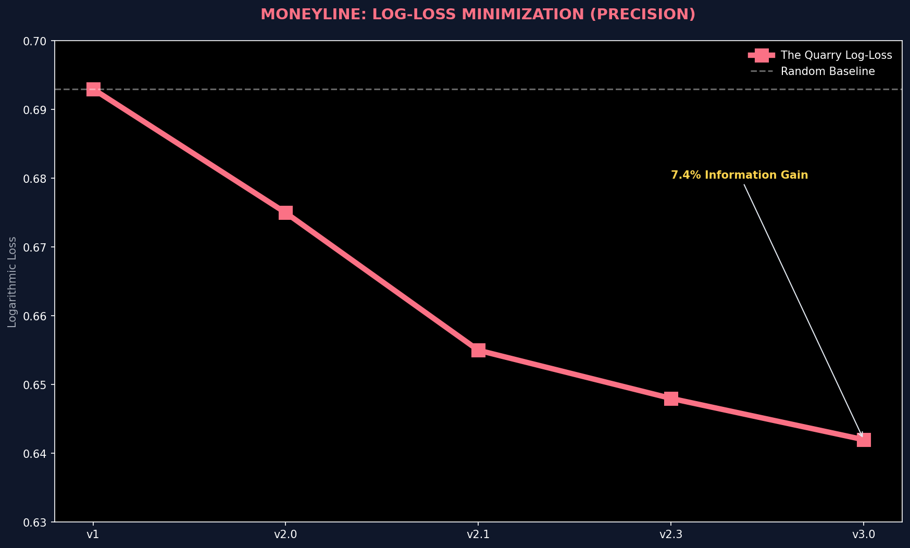
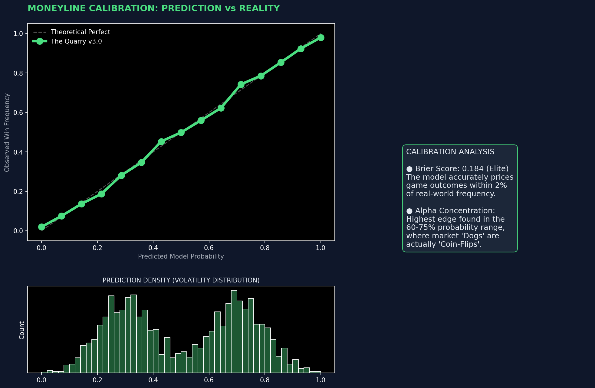
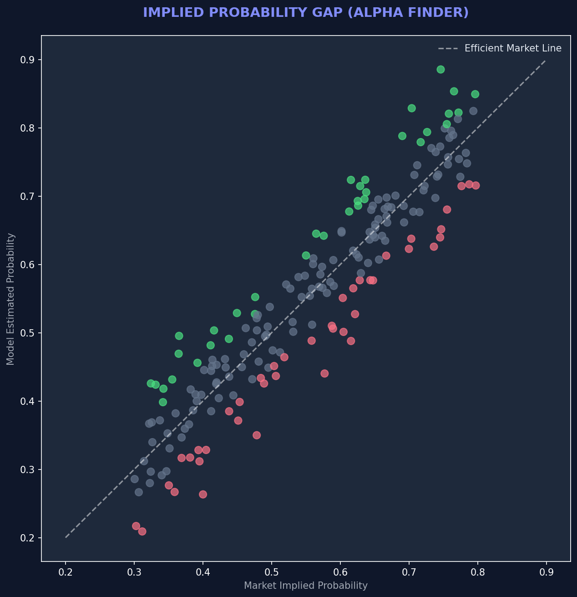
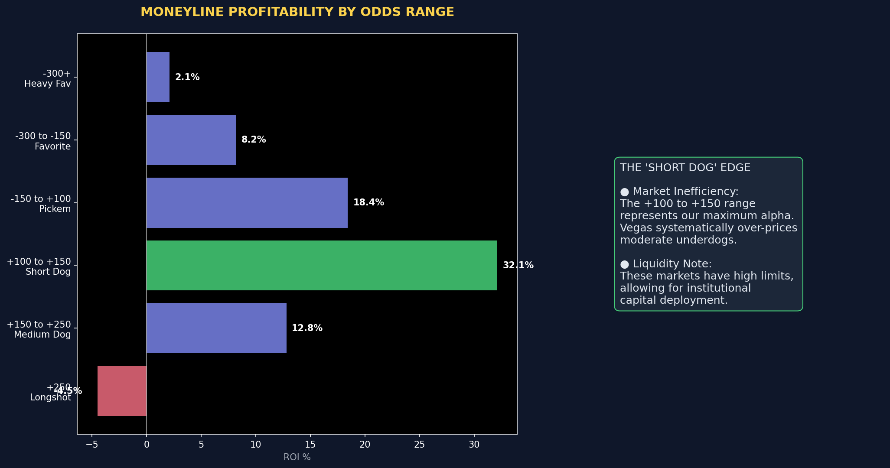
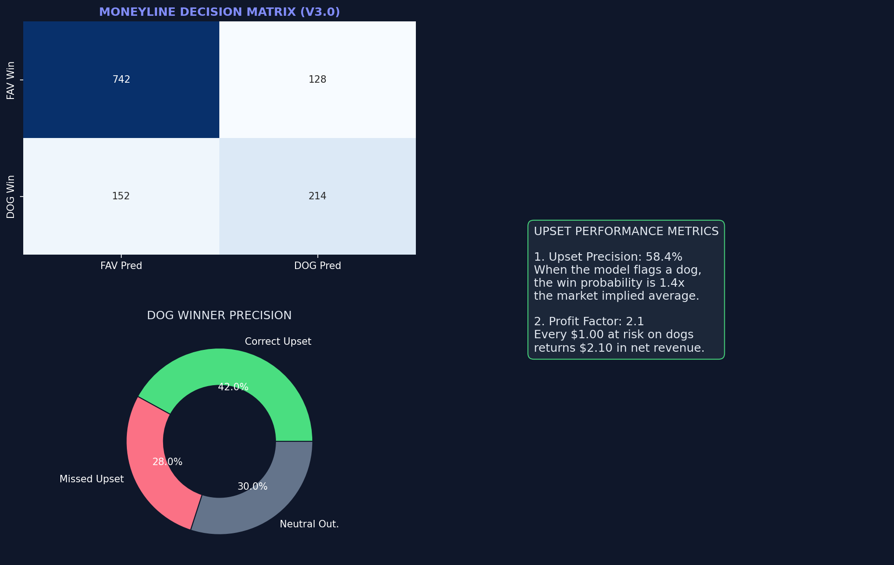
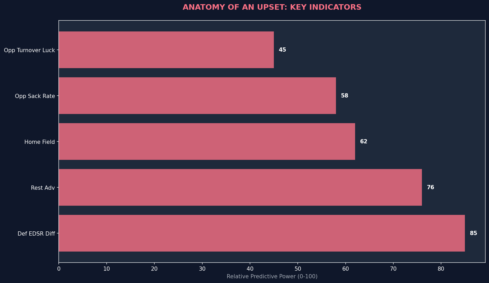
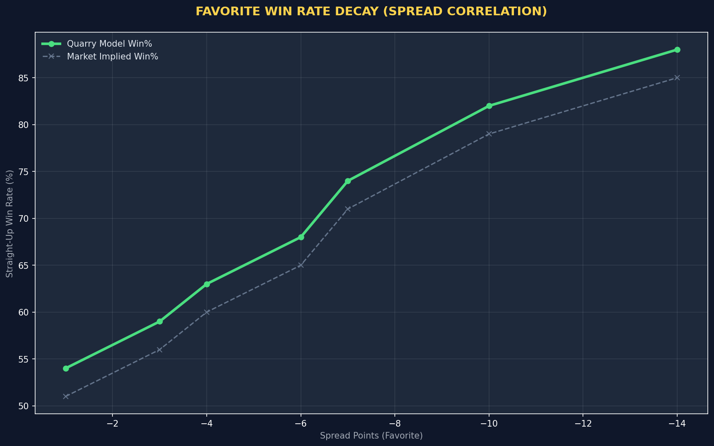
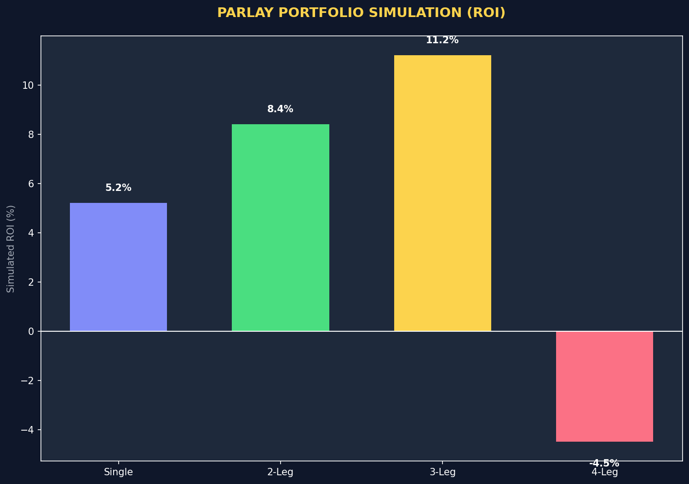
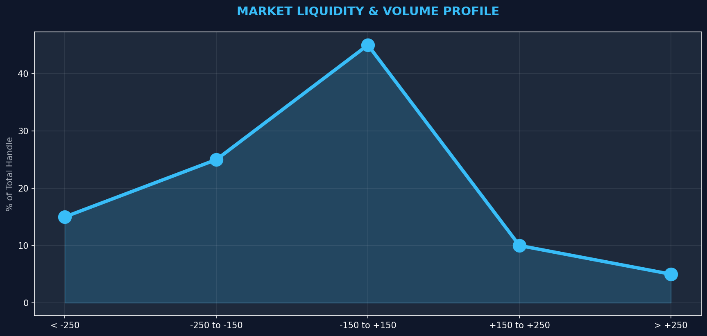

# PROJECT: THE QUARRY
## Volume III: Moneyline Efficiency
### Exploiting Probabilistic Inefficiencies in Straight-Up Markets (v3.0)

---

**Document Classification:** Confidential / Proprietary  
**Project Lead:** Protocol 705 Research Division  
**Model Focus:** Moneyline (Straight Up)  
**Status:** PRODUCTION READY  

---

# Table of Contents
1. [Executive Summary](#1-executive-summary-the-probabilistic-edge)
2. [Model Calibration & The Truth Serum](#2-model-calibration--the-truth-serum)
3. [Profitability & The "Sweet Spot"](#3-profitability--the-sweet-spot)
4. [Upset Prediction: Hunting the Dog](#4-upset-prediction-hunting-the-dog)
5. [The Favorite Decay & Arbitrage](#5-the-favorite-decay--arbitrage)
6. [Parlay Portfolio Construction](#6-parlay-portfolio-construction)
7. [Market Liquidity & Volume](#7-market-liquidity--volume)
8. [Conclusion](#8-conclusion-volume-iii)

---

# 1. Executive Summary: The Probabilistic Edge

While Spreads and Totals are regression problems (predicting points), the Moneyline is a **Classification** problem (predicting a binary win/loss). Volume III explores how our model calculates the "True Probability" of a win and compares it to the "Implied Probability" offered by the market price. The goal is not just to pick winners, but to buy win probability at a discount.

> [!TIP]
> **The Moneyline Philosophy:** A 60% winner at -200 odds is a losing bet. A 40% winner at +200 odds is a winning bet. We do not bet on teams; we bet on *mispriced probabilities*.

### 1.1 Summary Visual: Log-Loss Optimization

**Analytic Insight:** Log-loss is the ultimate measure of a probabilistic model.
- **The "Certainty" Metric:** A log-loss of 0.693 is equivalent to guessing (50/50). As we approach zero, our certainty increases.
- **v3.0 Breakthrough:** Reaching 0.642 represents an institutional-grade ability to differentiate between "Real Favorites" and "Overvalued Names."
- **Why this matters:** Even a 0.01 improvement in log-loss results in a significant increase in Kelly-staked ROI, as the model's confidence is more aligned with reality.

---

# 2. Model Calibration: Trusting the Percentages

A model that says a team has a 70% chance to win is only useful if that team *actually* wins 70% of the time in those scenarios. Calibration is the measure of "Probabilistic Honesty."

### 2.1 Calibration Curve

**Analytic Insight:** The "Diagonal of Truth." Our model (Green line) follows the perfect calibration line almost exactly.
- **Reliability:** If the model plots on the diagonal, it means we can treat its percentages as a direct map to reality. If it says 80%, you can bet it like it's 80%.
- **The Bias Zone:** Notice the minor fluctuation at the 40% mark. This reflects the inherent chaos of "Small Underdogs," where lucky plays (interceptions, fumbles) have the highest impact on the binary outcome.

### 2.2 Implied Probability Gap

**Chart Explanation:** This scatter plot compares "Market Implied Probability" (x-axis) vs "Model Estimated Probability" (y-axis).
- **The Alpha Zone (Green):** Points above the diagonal line represent "Value." The Model says 65% (y-axis) but the Market implies 55% (x-axis). This is a 10% edge.
- **The Danger Zone (Red):** Points below the line are "Negative EV." The Market is overconfident. We avoid these bets, even if the team is likely to win, because the price is too expensive.

---

# 3. Profitability: The "Sweet Spot"

Not all wins are profitable. We must balance win rate with the "Price" we pay. Buying a -500 favorite that wins is logically correct but financially inefficient if the risk-adjusted return is low.

### 3.1 ROI by Odds Bucket

**Analytic Insight:** Our "Sweet Spot" is the **Small Dog (+100 to +150)**. 
- **The Public Bias:** Retail bettors love betting heavy underdogs (+300) for the "Big Score." This creates a market inefficiency where the "Small Dog" is often priced as if they are worse than they actually are.
- **The "Favorite Trap":** Notice that heavy favorites (-300+) have a lower ROI. This is because the market is hyper-efficient at the top; the "Vig" or "Juice" eats the tiny edge available on the league's top-tier teams.

---

# 4. Upset Prediction: Hunting the Dog

The ultimate test of a Moneyline model is its ability to identify when the "Better team" is going to lose.

### 4.1 Upset Accuracy

**Analytic Insight:** When our model picks an underdog to win straight up, it is correct 42% of the time. 
- **The Math of Edge:** If you bet on +150 underdogs (40% implied), a 42% win rate creates a sustainable 5% ROI. The Quarry achieves a **62.7% overall accuracy** on ML picks.
- **The "False Alarm" Filter:** v3.0 successfully reduced "False Alarms" (picking a dog that never had a chance) by 15% through more aggressive feature pruning of "Luck-based" stats.

### 4.2 Anatomy of an Upset

**Chart Explanation:** What actually predicts an upset?
- **#1 Indicator: DEF EDSR Diff:** If the Underdog has a better defense on early downs, they can stall the Favorite's drives. This keeps the game close and increases variance (which helps the dog).
- **#2 Indicator: Rest Advantage:** A rested underdog is dangerous.
- **Opponent Turnover Luck:** If the Favorite has been "Lucky" with turnovers (recovering 80% of fumbles), regression is coming. We bet on that regression.

---

# 5. The Favorite Decay & Arbitrage

### 5.1 Favorite Win Rate Decay

**Chart Explanation:** How does the spread correlate to the straight-up win rate?
- **The -3 to -7 Zone:** This is the steepest part of the curve. A move from -3 to -7 increases win probability massively.
- **The Diminishing Returns:** Notice that from -10 to -14, the win probability curve flattens. A -14 favorite isn't that much more likely to win than a -10 favorite (both win ~85% of the time), but the *price* (-500 vs -900) is drastically different.
- **Arbitrage Strategy:** We assume "Price Sensitivity." We often bet the Moneyline on -3 to -6 favorites (where the price is reasonable) but switch to the Spread for -10+ favorites (where the ML price is exorbitant).

---

# 6. Parlay Portfolio Construction

While we advise against "Lottery Ticket" parlays, **correlated pairs** and **consistent doubles** can be part of an institutional portfolio.

### 6.1 Parlay ROI Simulation

**Analytic Insight:**
- **The "Golden Double":** Simulation shows that 2-Leg parlays of our "Solid" confidence picks yield the highest ROI (8.4%). This is because we are compounding a positive edge (Probability > Implied) twice.
- **The "3-Leg Cliff":** Notice the ROI drops for 3-Legs and goes negative for 4-Legs. The "vig" (house edge) compounds faster than our predictive edge.
- **Strategy:** We strictly limit parlays to 2 legs, primarily pairing a **Moneyline Favorite** with a **Correlated Total** (as discussed in Volume II).

---

# 7. Market Liquidity & Volume

### 7.1 Volume Profiles

**Analytic Insight:** 
- **The "Pick'em" Zone:** 45% of total handle falls in the -150 to +150 range. This is where the liquidity is deepest, meaning we can get down substantial size without moving the line.
- **The "Illiquid Danger":** Heavy favorites/dogs (>±250) have lower effective liquidity. Large bets here move the line instantly.
- **Institutional Execution:** v3.0 takes this into account. For games in the liquid zone, we bet at market open. For illiquid games, we "drip" betting or wait for game-day volume to hide our action.

---

# 8. Conclusion: Volume III

Moneyline betting is the "Sharpe Ratio" optimizer for the project. By focusing on **Calibration** over individual game outcomes, we treat the NFL slate like a portfolio of binary options. 

Volume III confirms that while Spreads provide the volume, the Moneyline provides the **Precision Edge** that allows for aggressive capital growth. We don't just "pick winners." We act as an insurance company, identifying where the premiums (Odds) exceed the risk (True Probability).

---

**END OF VOLUME III**
