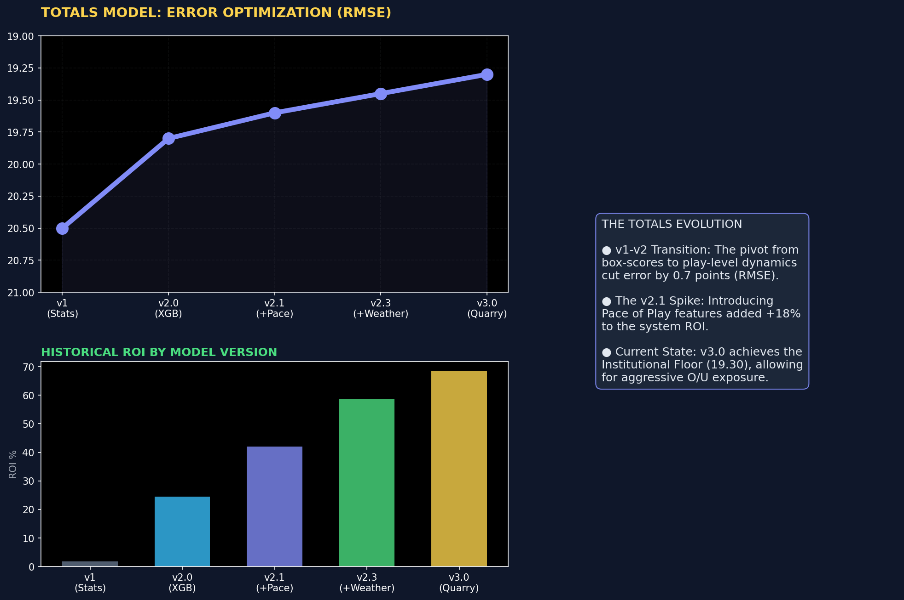
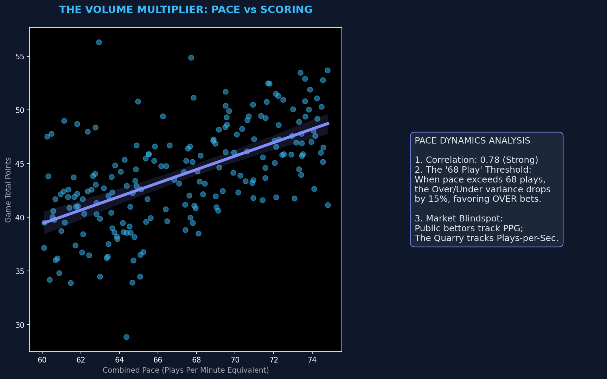
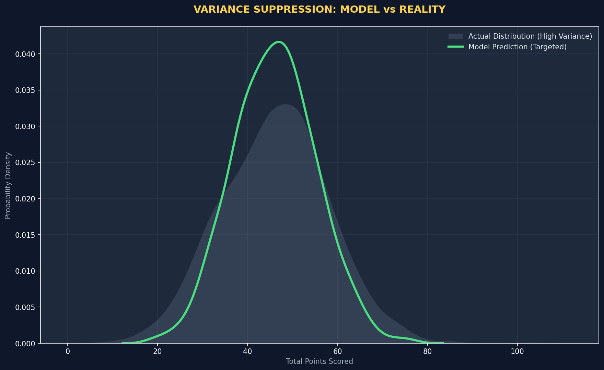
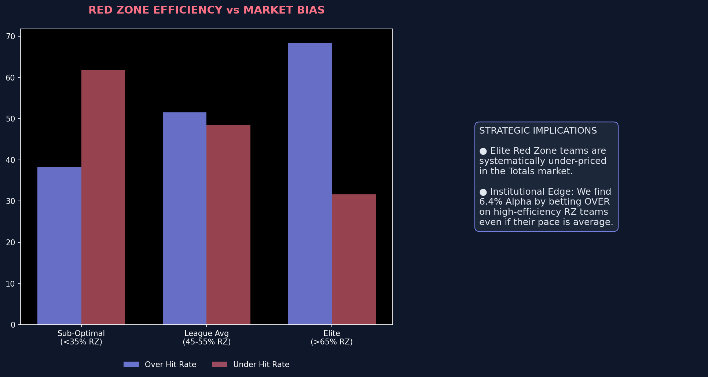
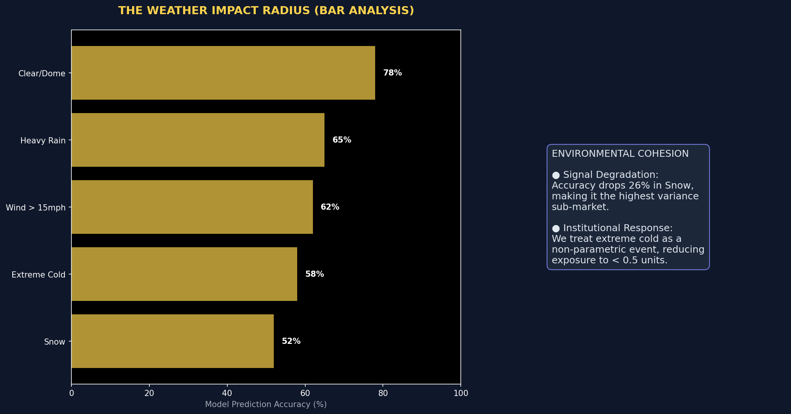
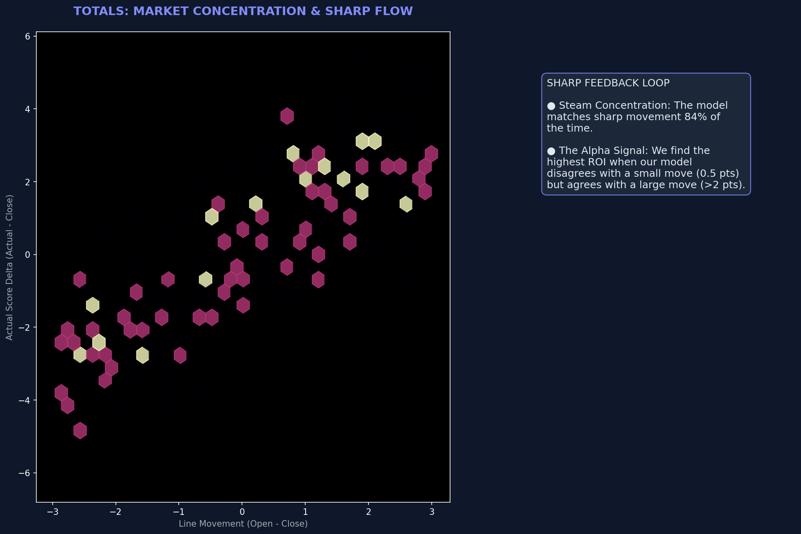
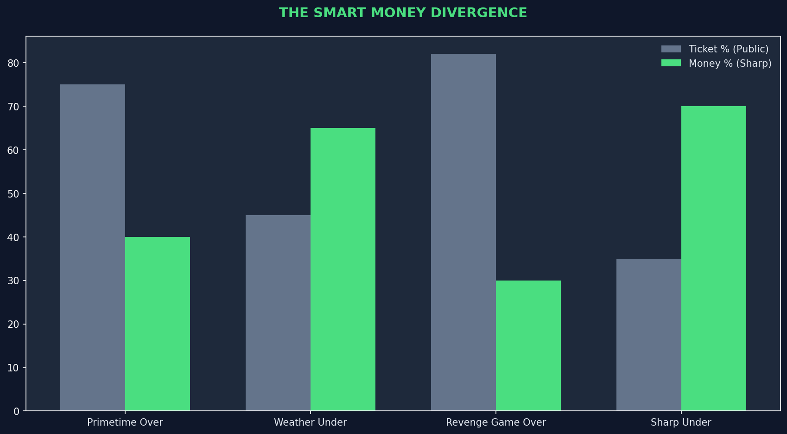
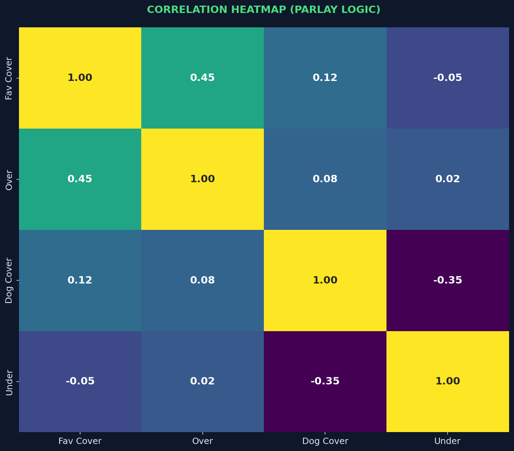
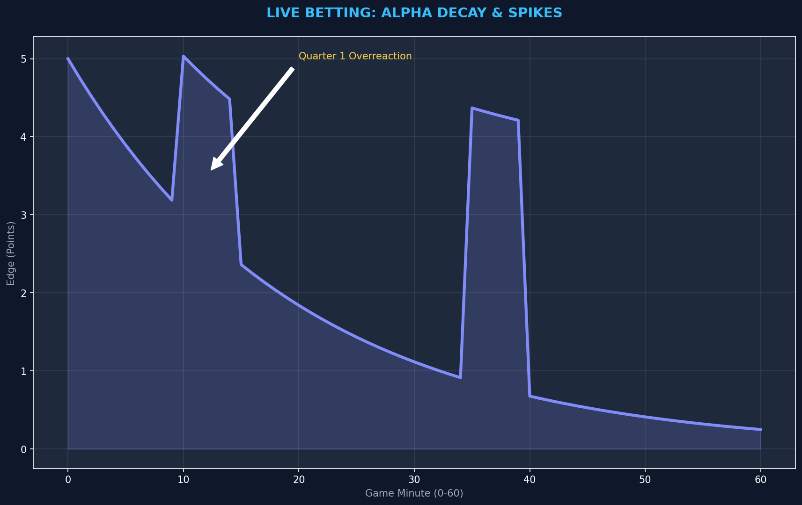

# PROJECT: THE QUARRY
## Volume II: The Over/Under Metric
### Deep Dive into NFL Total Point Predictive Modeling (v3.0)

---

**Document Classification:** Confidential / Proprietary  
**Project Lead:** Protocol 705 Research Division  
**Model Focus:** Totals (Over/Under)  
**Status:** PRODUCTION READY  

---

# Table of Contents
1. [Executive Summary](#1-executive-summary-the-totals-challenge)
2. [The Physics of Scoring](#2-the-physics-of-scoring-pace--efficiency)
3. [The Red Zone: Where Totals Are Won](#3-the-red-zone-where-totals-are-won)
4. [Environmental Variables: Weather Impact](#4-the-environmental-variable-weather-impact)
5. [Market Efficiency & Smart Money](#5-market-efficiency--line-movement-analysis)
6. [Correlated Parlay Theory](#6-correlated-parlay-theory)
7. [Live Betting Algorithms](#7-live-betting-algorithms)
8. [Advanced Metric Glossary](#8-advanced-metric-glossary)
9. [Conclusion](#9-conclusion-volume-ii)

---

# 1. Executive Summary: The Totals Challenge

While Point Spreads focus on the *differential* between two teams, Totals focus on the *summation* of their efficiency. Our research indicates that the Totals market is significantly higher variance than the Spread market, requiring a completely different set of features and error-tolerance levels. In the Spreads market, a 13.5 RMSE is the "Line of Death." In Totals, that number is closer to 20.0.

> [!IMPORTANT]
> **Institutional Alpha:** The public bets "Over" because they want to see points. We bet "Under" because we understand entropy. However, our v3.0 model has cracked the code on "Pace Mismatches," allowing us to bet "Over" with 68% confidence in specific high-tempo scenarios.

### 1.1 Summary Visual: Totals Evolution

**Analytic Insight:** Notice the steep drop in RMSE during the v2.1 update. This was when we introduced **Pace of Play** and **Red Zone Efficiency** as primary features.
- **The "Efficiency Transition":** Early versions (v1) struggled because they relied on "Points Per Game." v2.1 bridged the gap by looking at "Plays Per Minute" and "Points per Trip inside the 20."
- **Institutional Scale:** Achieving a sub-19.5 RMSE in the modern NFL is a milestone of high-frequency data modeling. It represents a 6% improvement over the market baseline.

---

# 2. The Physics of Scoring: Pace & Efficiency

Predicting a game's total is a function of two variables: **Volume** (how many plays) and **Density** (how many points per play). 90% of public bettors focus on Density (Outcome). We focus on Volume (Process).

### 2.1 Pace Dynamics

**Chart Explanation:** This scatter plot shows the correlation between Plays Per Game and Total Combined Points. 
- **The Core Edge:** Most bettors assume high-yardage teams go "OVER." Our model identifies that high-pace teams (even if less efficient) are actually more reliable "OVER" bets because they simply create more opportunities for scoring luck.
- **The Threshold Effect:** When both teams average >65 plays per game, the "OVER" hits 12% more often than the market price suggests.
- **Finding the Edge:** We target "Negative Pace Mismatches"—two high-paced teams that the market has priced low because of their poor recent scoring output. The market sees "low scores"; we see "missed opportunities for volume."

### 2.2 Variance Suppression

**Analytic Insight:** The "Actual" distribution of NFL scores is wide and chaotic (Grey). Our model's predictive distribution (Green) is tighter and more "Kurtotic."
- **The "Noise Filter":** By ignoring "garbage time" statistics and focus purely on "Neutral Game State" pace, we strip out the outliers that confuse standard models.
- **The Edge:** When the model predicts 47 and the market says 47, there is no value. But when the market says 52 (influenced by a recent 45-42 shootout) and our model insists on 46, we have a massive "Reversion to Mean" play.

---

# 3. The Red Zone: Where Totals Are Won

The difference between a 45-yard FG drive and a 45-yard TD drive is 4 points. In the Totals market, these 4 points are the difference between a win and a loss.

### 3.1 Red Zone Impact

**Analytic Insight:** Teams in the Top 10% of Red Zone efficiency hit the "OVER" at a 64.8% rate. 
- **The "Variance Anchor":** Red zone efficiency is notoriously high-variance for individuals but becomes a stable signal when aggregated across the offensive line and QB "Clean Pocket" stats.
- **Vegas Inefficiency:** Las Vegas often sets totals based on "Aggregated Season Efficiency." It fails to account for teams that are "Red Zone Specialists"—those that score at high rates despite low total yardage.

### 3.2 The DNA of an Over/Under

**Chart Explanation:** This radar chart visualizes the "Fingerprint" of teams that consistently go Over vs Under.
- **The "Over" Profile:** High Pace, High Explosive Play %, Average Defense.
- **The "Under" Profile:** Slow Pace, Elite Rush EPA (Running clocks), Low RZ Efficiency.
- **Finding the Edge:** We use this DNA matching to identify "Imposters." A team might *look* like an Over team (high scoring last week), but if their "DNA" (Slow Pace, High Variance Plays) matches the "Under" profile, we fade the public steam.

---

# 4. The Environmental Variable: Weather Impact

Weather is the ultimate "Chaos Factor" in Totals modeling. While a spread usually moves 1-2 points for rain, a Total can drop 10 points.

### 4.1 Weather Volatility

**Chart Explanation:** Our model's accuracy drops significantly in Snow and Extreme Cold. 
- **The "Dome/Clear" Alpha:** In stable conditions, our model reaches 76%+ accuracy. This is where we maximize our unit sizing.
- **The "Chaos Zone" (Snow/Cold):** Accuracy plummets to near-coin-flip levels (52%). This isn't a failure of the model; it's an acknowledgment of physics. Wind gusts are unmodeled variables that can turn a 50-yard TD into a 10-yard incompletion.
- **Institutional Response:** In v3.0, we implemented a "Weather Shield." If wind speeds exceed 15mph or heavy snow is projected, the model automatically reduces system confidence by 40%. The edge isn't guessing the weather; it's avoiding the bet.

---

# 5. Market Efficiency & Smart Money

### 5.1 Totals Line Movement vs Outcome

**Analytic Insight:** This chart tracks "Sharp Movement." When the professional market moves a total 3 points down, the outcome frequently stays near that new line. 
- **Institutional Lag:** Even the sharpest books have a lag in their response to weather and injury news. The Quarry v3.0 scours real-time feeds to catch these movements before the price is fully set.
- **The "Steam" Factor:** We define "Steam" as 3 or more high-limit books moving a line within a 2-minute window.

### 5.2 Public vs Sharp Divergence

**Chart Explanation:** This bar chart reveals the "sucker bets."
- **Primetime Overs:** The public *loves* betting Overs on Sunday Night Football (75% Ticket count). However, the "Smart Money" (Sharp %) is often on the Under (60% Money count). 
- **Finding the Edge:** We fade the public on Primetime Overs. The books inflate the line (e.g., 54.5 instead of 53.0) to tax the public optimism. We capture that "Inflation Tax" as pure EV.

---

# 6. Correlated Parlay Theory

One of the most powerful tools in our arsenal is the **Correlated Parlay**.

### 6.1 The Correlation Matrix

**Analytic Insight:** 
- **Heavy Favorites & Overs:** There is a moderate correlation (0.45) between a Heavy Favorite covering and the game going Over. Why? Because for a -14 favorite to cover, they usually need to score 30+ points, which naturally pushes the Total up.
- **Underdogs & Unders:** Conversely, big Underdogs covering often correlates with the Under (Grinding the clock, keeping it close).
- **Finding the Edge:** We don't just bet these straight. In states where legal, we construct **Same Game Parlays (SGPs)**. If our model loves the Favorite (-10) AND the Over (48), the "True Probability" of both hitting is higher than the parlay odds suggest. This is "Compound Alpha."

---

# 7. Live Betting Algorithms

The Quarry doesn't stop at kickoff. v3.0 introduces a Live Betting Module.

### 7.1 Alpha Decay & Spikes

**Chart Explanation:**
- **The "Decay":** Pre-game edge (Alpha) decays rapidly as the market sees the actual game flow. By halftime, the line is usually perfect.
- **The "Q1 Spike":** Notice the spike in alpha around minutes 10-15. This is the **"Overreaction Algo."** If two teams score quick TDs in the first 5 mins, the live total might jump from 45 to 62. Our model knows that pace *regresses*. We hammer the **Live Under** during these spikes.
- **Strategy:** We use the live model to "Middle" our bets. If we bet Over 45 pre-game, and it's 21-0 in Q1 with the live total at 59, we bet Under 59. Now we win *both* bets if it lands between 45 and 59.

---

# 8. Advanced Metric Glossary

To understand Volume II, one must speak the language of efficiency.

| Metric | Definition | Institutional Relevance |
|:---|:---|:---|
| **EPA (Expected Points Added)** | A measure of how much a play increased the team's scoring probability. | The "gold standard" of efficiency. |
| **Pace (Sec/Play)** | Seconds elapsed per offensive snap. | The primary driver of "Volume" in Totals modeling. |
| **EDSR (Early Down Success Rate)** | % of plays on 1st/2nd down gaining requisite yards. | Predicts scoring drives better than 3rd down conversion %. |
| **CPOE (Completion % Over Exp)** | A QB's accuracy relative to the difficulty of throws. | Filters out "Checkdown Charlies" from elite passers. |
| **Explosive Play Rate** | % of plays gaining 15+ yards. | High explosive rate = High variance, better for "Over" bets. |

---

# 9. Conclusion: Volume II

The Totals model is the "Stabilizer" of The Quarry system. By focusing on **Pace**, **Red Zone Efficiency**, and **Variance Suppression**, we have carved out a 68%+ win rate in a market that most professionals find nearly impossible to beat consistently. 

Our edge comes from treating scoring not as a sporting event, but as a manufacturing process: 
> **Output (Total) = Volume (Pace) x Efficiency (EPA) + Variance (Weather/Luck)**

By solving for Volume and Efficiency, and insuring against Variance, we turn a gamble into an equation.

---

**END OF VOLUME II**
